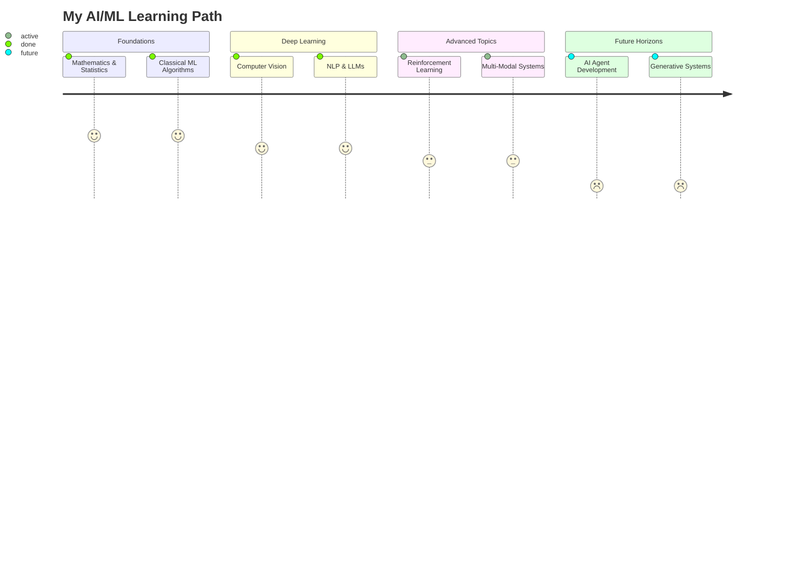

<!-- HEADER -->
<div align="center">
  <h1>
    
  </h1>
  
  <p>
    <a href="https://git.io/typing-svg">
      
    </a>
  </p>

  <p align="center">
    
    <a href="https://linkedin.com/in/faisal-hakimi55">
      
    </a>
    <a href="https://medium.com/@faisalh5556">
      
    </a>
    <a href="mailto:Faisalh5556@gmail.com">
      
    </a>
    <a href="https://github.com/Faisalhakimi22?tab=repositories">
      
    </a>
  </p>
</div>

<!-- ABOUT ME SECTION -->
<div align="center">
  
  
</div>

<!-- ABOUT ME SECTION -->
##  About Me

```python
#!/usr/bin/python
# -*- coding: utf-8 -*-

class AIEngineer:
    def __init__(self):
        self.name = "Faisal Hakimi"
        self.education = "Computer Science @ IM|Sciences [CGPA: 3.61/4.0]"
        self.focus_areas = {
            "primary": ["Computer Vision", "Large Language Models", "ML Systems Design"],
            "secondary": ["Reinforcement Learning", "Multi-Modal AI", "Edge ML"]
        }
        self.current_work = [
            "Building ML systems for real-world problems",
            "Exploring multi-modal approaches for complex AI tasks",
            "Developing edge-optimized computer vision models"
        ]
                
    def say_hello(self):
        print("Thanks for dropping by! I'm passionate about building intelligent systems that solve real problems.")
        
    def get_interests(self):
        return [
            "🔬 Research in computer vision & LLMs",
            "🚀 Scaling AI systems for production",
            "🌍 Ethical and accessible AI development",
            "📊 Data-driven decision making"
        ]

# Create instance
me = AIEngineer()
me.say_hello()
```

<!-- SKILLS SECTION -->
##  Technical Arsenal

<table>
  <tr>
    <td>
      <h3>🧠 Machine Learning & AI</h3>
      
      
      
      
      
      
      
      
    </td>
    <td>
      <h3>👨‍💻 Languages & Frameworks</h3>
      
      
      
      
      
      
      
      
    </td>
  </tr>
  <tr>
    <td>
      <h3>📊 Data Science Tools</h3>
      
      
      
      
      
      
      
    </td>
    <td>
      <h3>🛠️ Development & DevOps</h3>
      
      
      
      
      
      
      
    </td>
  </tr>
</table>

<!-- PROJECTS SECTION -->
##  Featured Projects

<div align="center">
  <table>
    <tr>
      <td width="50%">
        <h3 align="center">🔮 AI Market Intelligence Platform</h3>
        <div align="center">
          <a href="https://github.com/Faisalhakimi22" target="_blank">
            
          </a>
        </div>
        <p align="center">
          <strong>TypeScript, GPT-4, Express.js, PostgreSQL</strong>
        </p>
        <p align="center">
          AI-powered market analysis tool that combines real-time data with LLM insights to identify opportunities and evaluate product-market fit.
        </p>
      </td>
      <td width="50%">
        <h3 align="center">♻️ Smart Waste Classifier</h3>
        <div align="center">
          <a href="https://github.com/Faisalhakimi22" target="_blank">
            
          </a>
        </div>
        <p align="center">
          <strong>Python, YOLOv5, Streamlit, OpenCV, Raspberry Pi</strong>
        </p>
        <p align="center">
          Edge-optimized CV system that identifies recyclable materials in real-time with 80.1% mAP@50 and <10ms inference time.
        </p>
      </td>
    </tr>
    <tr>
      <td width="50%">
        <h3 align="center">📡 RIS Control Interface</h3>
        <div align="center">
          <a href="https://github.com/Faisalhakimi22/Market-Intelligence-Platform" target="_blank">
            
          </a>
        </div>
        <p align="center">
          <strong>Python, NumPy, Matplotlib, Tkinter</strong>
        </p>
        <p align="center">
          Simulation and control system for Reconfigurable Intelligent Surfaces (RIS) that optimizes wireless signal propagation.
        </p>
      </td>
      <td width="50%">
        <h3 align="center">🤖 Enterprise AI Chatbot</h3>
        <div align="center">
          <a href="https://github.com/Faisalhakimi22" target="_blank">
            
          </a>
        </div>
        <p align="center">
          <strong>Rasa, GPT-3.5, LangChain</strong>
        </p>
        <p align="center">
          Contextual customer support system with dynamic intent recognition and GPT integration, reducing response time by 40%.
        </p>
      </td>
    </tr>
  </table>
</div>

<!-- JOURNEY SECTION -->
##  My AI/ML Journey

<div align="center">
  
</div>



<!-- GOALS SECTION -->
##  Future Trajectory

<table>
  <tr>
    <td>
      <h3>🚀 Short-Term Goals</h3>
      <ul>
        <li>🔬 <strong>Research internship in AI/ML</strong><br>Contribute to cutting-edge research in vision or LLMs</li>
        <li>🏗️ <strong>Build production-grade ML systems</strong><br>Develop scalable, reliable AI solutions</li>
        <li>🌱 <strong>Contribute to open-source ML libraries</strong><br>Give back to the community that empowered me</li>
      </ul>
    </td>
    <td>
      <h3>🌠 Long-Term Vision</h3>
      <ul>
        <li>🌍 <strong>Create impactful AI systems</strong><br>Develop solutions with measurable social benefits</li>
        <li>🔮 <strong>Advance multi-modal AI research</strong><br>Push boundaries of how AI perceives and interacts</li>
        <li>🤝 <strong>Build ethical AI systems</strong><br>Design technology that empowers underserved communities</li>
      </ul>
    </td>
  </tr>
  <tr>
    <td colspan="2">
      <h3 align="center">🔍 Currently Seeking</h3>
      <p align="center">
        
        
        
      </p>
    </td>
  </tr>
</table>

<!-- METRICS SECTION -->
##  GitHub Metrics

<p align="center">
  
</p>

<p align="center">
  
  
</p>

<!-- FOOTER -->
<div align="center">
  
  <p>
    
  </p>
  <p>"The future belongs to those who believe in the intelligence of their dreams."</p>
  <p>
    
  </p>
</div>

<!-- Crafted with 💻 and ☕ by Faisal Hakimi -->
